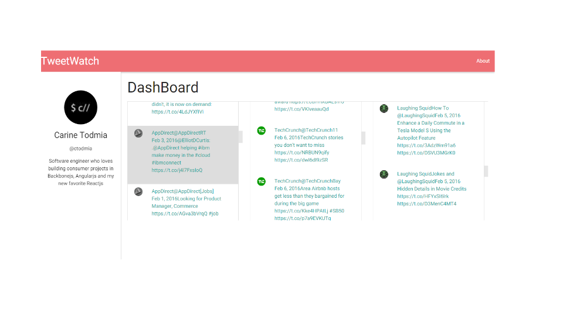

# TweetWatch

> A Twitter feed monitor to help you keep track of your favorite profiles

Live Demo Coming soon: [Live Demo](https://tweetwatcher.herokuapp.com/)




## Table of Contents

1. [Owner](#owner)
1. [Technology Stack](#technology-stack)
1. [Application Overview](#application-overview)
1. [Project Roadmap](#project-roadmap)
1. [Usage](#usage)
    1. [Requirements](#requirements)
    1. [Installing Dependencies](#installing-dependencies)
1. [Contributing](#contributing)

<br>

### Owner

[](https://github.com/ctodmia) <br>Carine Todmia

[LinkedIn](https://www.linkedin.com/in/carinetodmia) | [Twitter](https://twitter.com/cinfinitymedia)|[Website](http://carinetodmia.com)


<br>

### Technology Stack

 |  ||
--- | --- | --- | --- |
Angular.js | MongoDB| Node.js|Express.js

Other:

Angular Material Design

<br>
### Application Overview

Feature showcase: 

The sellview of the application allows sellers to create inventory cards that are later displayed to the entire marketplace
<a href="https://africaexpress.herokuapp.com/#/sell" target="_blank"></a>

The shopview is modern display of all the available inventory in the application. 
<a href="https://africaexpress.herokuapp.com/#/shop" target="_blank"></a>


<br>
### Requirements

- Node    &ensp;&ensp;&ensp;&ensp;&ensp;&ensp;&ensp;&ensp;&ensp;version 3.0+
- Bower   &ensp;&ensp;&ensp;&ensp;&ensp;&ensp;&ensp;&ensp;version 1.4+


### Installing Dependencies

From within the root directory:

```sh
sudo npm install -g bower
npm install
bower install
```
