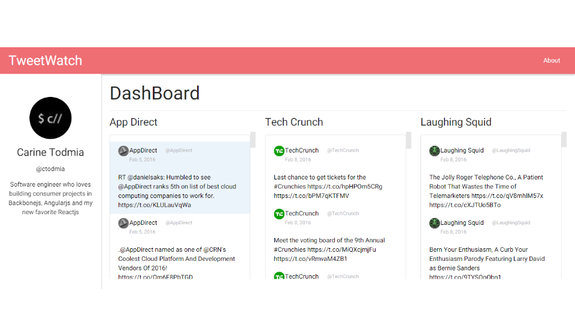

# TweetWatch

> A Twitter feed monitor to help you keep track of your favorite profiles



### Owner

[](https://github.com/ctodmia) <br>Carine Todmia

[LinkedIn](https://www.linkedin.com/in/carinetodmia) | [Twitter](https://twitter.com/cinfinitymedia)|[Website](http://carinetodmia.com)


<br>

### Technology Stack

 |  ||
--- | --- | --- | --- |
React.js | Backbonejs| Node.js|Express.js

Other:


<br>
### Application Overview

Feature showcase: 

The application features a three column view of the lastest tweets. Users are redirected to the original tweet when clicked on. Users also have the option of switching the order of the columns by dragging and dropping the column to the target position. 

Drag and Drop


Mobile Compatible


<br>
### Requirements

- Node    &ensp;&ensp;&ensp;&ensp;&ensp;&ensp;&ensp;&ensp;&ensp;version 3.0+
- Bower   &ensp;&ensp;&ensp;&ensp;&ensp;&ensp;&ensp;&ensp;version 1.4+

NOTE **************** ensure the bower_components folder is installed in client folder.

### Installing Dependencies

From within the root directory:

```sh
sudo npm install -g bower
npm install
bower install
```
Connecting to twitter API

1. Use the following link to obtain a consumerKey, consumerSecret, accessToken, accessTokenSecret from twitter.com
https://apps.twitter.com/

2. Creat a config.js file in the root project folder.

3. Copy and paste the format from config_template.js to config.js and fill out the empty keys with information acquired from twitter. 
